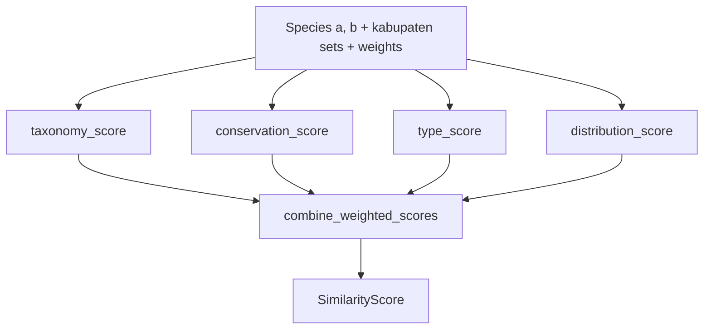

# Pair Similarity — Module 4

> **Status: draft starter — content pending.**

## Overview

`calculate_pair_similarity` menghitung skor kesamaan antara dua spesies
berdasarkan taksonomi, status konservasi, tipe spesies, dan distribusi
kabupaten. Dipakai oleh `compare_species` (via `calculate_all_pairs`) dan
dapat digunakan ulang oleh modul lain.

## Signature

```rust
pub fn calculate_pair_similarity(
    a: &Species,
    b: &Species,
    kabupaten_a: &HashSet<u64>,
    kabupaten_b: &HashSet<u64>,
    weights: &ScoringWeights,
) -> SimilarityScore
```

## Score Components

| Component | Source | Shared helper |
|-----------|--------|---------------|
| `taxonomy_score` | Perbandingan `Taxonomy` a vs b | `calculate_taxonomy_similarity` |
| `conservation_score` | Status IUCN / CITES | internal `score_conservation` |
| `type_score` | `species_type` a vs b | internal `score_species_type` |
| `distribution_score` | Overlap kabupaten | `jaccard_similarity` |
| `total_score` | Weighted combination | `combine_weighted_scores` |

## Flow



## Example (intended usage)

```rust,ignore
let score = calculate_pair_similarity(&sp_a, &sp_b, &kab_a, &kab_b, &weights);
println!("{} <-> {}: {:.2}", score.species_a_id, score.species_b_id, score.total_score);
```

## TODO

- [ ] Detail rumus `score_conservation` dan `score_species_type`
- [ ] Batas nilai skor (normalisasi 0..=1)
- [ ] Edge cases: himpunan kabupaten kosong, bobot tidak valid
- [ ] Contoh nyata dengan fixture `shared/fixtures/`
