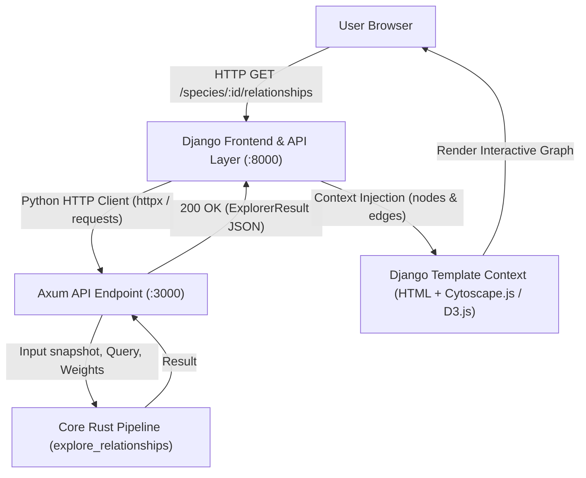
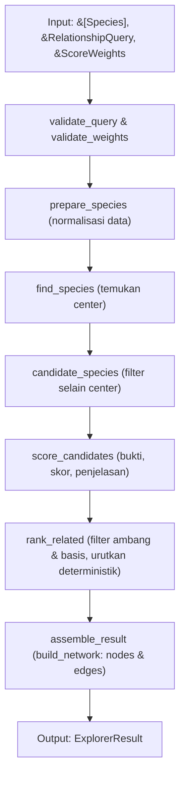
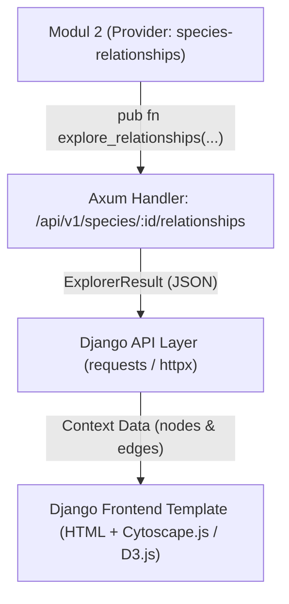
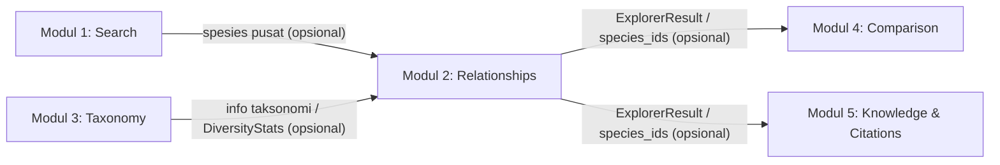

# Planning Function — Modul 2: Species Relationship Explorer

**Mata Kuliah:** Pemrograman Fungsional  
**Bahasa:** Rust  
**Cakupan:** Backend penemuan spesies terkait, perhitungan kekuatan hubungan, penjelasan hubungan, serta penyediaan data jaringan spesies melalui API JSON.  
**Teknologi:** Rust untuk domain dan komputasi inti; Axum untuk layanan HTTP/API (unified server).  
**Repository:** Part of KalimantanBio monorepo workspace (`crates/species-relationships`)  
**API Integration:** Production KalimantanBio API (PostgreSQL via shared library)

> **PENTING**: Modul ini menggunakan **Shared Library** (`kalimantanbio-shared`) untuk tipe data dan fungsi umum. Lihat [MASTERPLAN.md](../MASTERPLAN.md) untuk arsitektur lengkap.

**Dasar penyusunan:** Modul 2 dalam spesifikasi KalimantanBio. Model data, formula, batas permintaan, dan kontrak integrasi di bawah merupakan rancangan awal. Pembagian PIC mengikuti keputusan tim yang terdiri dari tiga anggota: Anggota 1 menangani Tahap 1 dan 3, Anggota 2 menangani Tahap 2, serta Anggota 3 menangani Tahap 4 dan 5.

---

## 1. Tujuan Modul

Mengembangkan backend yang menyediakan fungsi dan API untuk menemukan dan menelusuri hubungan antara spesies berdasarkan kesamaan taksonomi, habitat, karakteristik, serta atribut biodiversitas lain yang tersedia. Hasil harus dapat diverifikasi melalui komponen skor dan bukti atribut yang digunakan.

Modul ini bertanggung jawab untuk:

* **Related Species Discovery:** menemukan dan mengurutkan spesies yang memiliki kesamaan dengan spesies pilihan pengguna.
* **Relationship Scoring:** menghitung kekuatan hubungan secara deterministik berdasarkan aturan yang disepakati.
* **Relationship Explanation:** menjelaskan atribut yang sama, kontribusinya terhadap skor, dan keterbatasan data.
* **Interactive Species Network (dukungan backend):** menyediakan node, edge, skor, dan penjelasan melalui JSON agar nantinya dapat digunakan oleh frontend Django. Pergantian spesies pusat dan filter dilakukan melalui parameter permintaan API.

### Batasan Modul

Modul ini **tidak bertanggung jawab** terhadap:

* Pemilihan framework frontend dan rendering visual graf (tanggung jawab Django frontend dan visualizer client-side seperti Cytoscape.js/D3.js di template Django).
* Pencarian bahasa alami dan rekomendasi kueri pada Modul 1.
* Pohon taksonomi lengkap serta analisis cakupan taksonomi pada Modul 3.
* Tabel perbandingan banyak spesies dan analisis ciri pembeda lengkap pada Modul 4.
* Penemuan publikasi dan pengelolaan sitasi pada Modul 5.
* Pengumpulan data, verifikasi biologis data sumber, atau penyelesaian sinonim otomatis; modul menerima data yang telah dikurasi.
* Inferensi hubungan predator–mangsa, simbiosis, sebab-akibat ekologis, atau pohon filogenetik dari kesamaan atribut saja.

**Ruang lingkup versi awal:** tiga dimensi skor, yaitu taksonomi, habitat, dan karakteristik terstruktur. Data jaringan awal berupa satu spesies pusat dengan tetangga terpilih; permintaan API berikutnya dapat menggunakan ID tetangga sebagai pusat baru.

---

## 2. Shared Library Integration

Modul ini menggunakan **shared library** (`kalimantanbio-shared`) untuk tipe data dan fungsi umum yang digunakan bersama dengan modul lain.

### 2.1 Shared Types Used

```rust
use kalimantanbio_shared::core::{Species, Taxonomy};
```

**Species** dan **Taxonomy** adalah tipe standar yang digunakan oleh semua modul. Definisi lengkap ada di shared library.

### 2.2 Shared Functions Used

#### From `taxonomy` module:
```rust
use kalimantanbio_shared::taxonomy::calculate_taxonomy_similarity;
```

- `calculate_taxonomy_similarity(a: &Taxonomy, b: &Taxonomy) -> f64` - Menghitung skor kesamaan taksonomi (0.0-1.0)

**Digunakan di**: Tahap 2 (Ekstraksi Bukti dan Scoring)

#### From `collections` module:
```rust
use kalimantanbio_shared::collections::jaccard_similarity;
```

- `jaccard_similarity<T>(a: &HashSet<T>, b: &HashSet<T>) -> f64` - Menghitung Jaccard similarity untuk habitat/karakteristik

**Digunakan di**: Tahap 2 (Ekstraksi Bukti dan Scoring)

#### From `scoring` module:
```rust
use kalimantanbio_shared::scoring::combine_weighted_scores;
```

- `combine_weighted_scores(scores: &[(f64, f64)]) -> f64` - Menggabungkan skor dengan bobot

**Digunakan di**: Tahap 2 (Relationship Scoring)

#### From `validation` module:
```rust
use kalimantanbio_shared::validation::{validate_score_range, validate_weights_sum_to_one};
```

- `validate_score_range(score: f64, min: f64, max: f64) -> Result<(), ValidationError>` - Validasi skor dalam range
- `validate_weights_sum_to_one(weights: &[f64], tolerance: f64) -> Result<(), ValidationError>` - Validasi bobot

**Digunakan di**: Tahap 1 (Validasi dan Normalisasi)

#### From `db` module:
```rust
use kalimantanbio_shared::db::{create_pool, fetch_all_species, fetch_species_by_id};
```

- `create_pool(database_url: &str) -> Result<Pool<Postgres>>` - Membuat connection pool
- `fetch_all_species(pool: &Pool<Postgres>) -> Result<Vec<Species>>` - Fetch semua spesies
- `fetch_species_by_id(pool: &Pool<Postgres>, id: u64) -> Result<Option<Species>>` - Fetch spesies by ID

**Digunakan di**: Tahap 5 (Integrasi API Axum)

### 2.3 Module-Specific Types

Modul ini mendefinisikan tipe tambahan yang spesifik untuk relationship exploration:

```rust
#[derive(Debug, Clone, Copy, PartialEq, Eq)]
enum AttributeKind { Taxonomy, Habitat, Characteristic }

#[derive(Debug, Clone)]
struct ScoreWeights {
    taxonomy: f64,
    habitat: f64,
    characteristic: f64,
}

#[derive(Debug, Clone)]
struct RelationshipQuery {
    species_id: u64,
    min_score: f64,
    limit: usize,
    required_basis: Option<AttributeKind>,
}

#[derive(Debug, Clone)]
struct AttributeEvidence {
    attribute: AttributeKind,
    similarity: Option<f64>,
    shared_values: Vec<String>,
}

#[derive(Debug, Clone)]
struct RelationshipScore {
    total: f64,
    coverage: f64,
    evidence: Vec<AttributeEvidence>,
}

#[derive(Debug, Clone)]
struct RelatedSpecies {
    species: Species,
    score: RelationshipScore,
    explanations: Vec<String>,
}

#[derive(Debug, Clone)]
struct NetworkNode {
    id: u64,
    label: String,
    is_center: bool,
}

#[derive(Debug, Clone)]
struct NetworkEdge {
    source: u64,
    target: u64,
    score: RelationshipScore,
    explanations: Vec<String>,
}

#[derive(Debug, Clone)]
struct SpeciesNetwork {
    nodes: Vec<NetworkNode>,
    edges: Vec<NetworkEdge>,
}

#[derive(Debug, Clone)]
struct ExplorerResult {
    center_id: u64,
    related: Vec<RelatedSpecies>,
    network: SpeciesNetwork,
    weights: ScoreWeights,
    scoring_version: String,
}
```

### 2.4 Cargo.toml Dependency

```toml
[dependencies]
kalimantanbio-shared = { path = "../shared" }
serde = { workspace = true }
tokio = { workspace = true }
```

### 2.5 Integration Example

```rust
use kalimantanbio_shared::{
    core::{Species, Taxonomy},
    taxonomy::calculate_taxonomy_similarity,
    collections::jaccard_similarity,
    scoring::combine_weighted_scores,
    validation::validate_weights_sum_to_one,
};
use std::collections::HashSet;

pub fn calculate_relationship(
    a: &Species,
    b: &Species,
    habitats_a: &HashSet<String>,
    habitats_b: &HashSet<String>,
    weights: &ScoreWeights,
) -> Result<RelationshipScore, ValidationError> {
    // Validasi bobot menggunakan shared library
    validate_weights_sum_to_one(
        &[weights.taxonomy, weights.habitat, weights.characteristic],
        1e-9
    )?;
    
    // Hitung skor taksonomi menggunakan shared library
    let taxonomy_score = calculate_taxonomy_similarity(&a.taxonomy, &b.taxonomy);
    
    // Hitung skor habitat menggunakan shared library
    let habitat_score = jaccard_similarity(habitats_a, habitats_b);
    
    // Gabungkan skor menggunakan shared library
    let total = combine_weighted_scores(&[
        (taxonomy_score, weights.taxonomy),
        (habitat_score, weights.habitat),
    ]);
    
    // Build RelationshipScore (module-specific)
    Ok(RelationshipScore {
        total,
        coverage: calculate_coverage(&weights, &[taxonomy_score, habitat_score]),
        evidence: collect_evidence(a, b),
    })
}
```

---

## 3. Struktur Data (Domain Model)

### 3.1 Tipe dari Shared Library

Modul ini menggunakan `Species` dan `Taxonomy` dari shared library. Lihat [MASTERPLAN.md](../MASTERPLAN.md) untuk definisi lengkap.

> **Catatan:** Struktur data sudah distandardisasi di shared library dan digunakan oleh semua modul. Tidak boleh ada modifikasi pada tipe ini tanpa koordinasi dengan project lead.

### 3.2 Module-Specific Types

Tipe berikut spesifik untuk Modul 2 dan didefinisikan di crate ini:

```rust
#[derive(Debug, Clone)]
struct RelatedSpecies {
    species: Species,
    score: RelationshipScore,
    explanations: Vec<String>,
}

#[derive(Debug, Clone)]
struct NetworkNode {
    id: SpeciesId,
    label: String,
    is_center: bool,
}

#[derive(Debug, Clone)]
struct NetworkEdge {
    source: SpeciesId,
    target: SpeciesId,
    score: RelationshipScore,
    explanations: Vec<String>,
}

#[derive(Debug, Clone)]
struct SpeciesNetwork {
    nodes: Vec<NetworkNode>,
    edges: Vec<NetworkEdge>,
}

#[derive(Debug, Clone)]
struct ExplorerResult {
    center_id: SpeciesId,
    related: Vec<RelatedSpecies>,
    network: SpeciesNetwork,
    weights: ScoreWeights,
    scoring_version: String,
}

#[derive(Debug, Clone, PartialEq, Eq)]
enum ExplorerError {
    InvalidQuery(String),
    InvalidWeights,
    InvalidDataset(String),
    SpeciesNotFound(SpeciesId),
}
```

> **Catatan:** Struktur data perlu disepakati seluruh anggota sebelum implementasi. `BTreeSet` dipilih untuk menghapus duplikasi dan menjaga urutan nilai yang stabil. Nilai `None` dan himpunan kosong menandakan data belum tersedia untuk perbandingan, bukan bukti bahwa atribut tersebut tidak dimiliki spesies.

### Data yang Digunakan

| Data | Tipe | Deskripsi |
| --- | --- | --- |
| `Species.id` | `String` | ID stabil dari repository; wajib unik dan tidak kosong. |
| `scientific_name` | `String` | Nama ilmiah untuk label; wajib tidak kosong dan kapitalisasi tampilannya dipertahankan. |
| `taxonomy` | `Taxonomy` | Ordo, famili, dan genus opsional; dibandingkan pada tingkat yang sama. |
| `habitats` | `BTreeSet<String>` | Label habitat dari kosakata terkendali. |
| `characteristics` | `BTreeSet<String>` | Karakteristik terstruktur, misalnya `growth_form:tree`; bukan pencocokan bebas seluruh paragraf. |
| `min_score` | `f64` | Ambang inklusif dalam rentang 0–1; default adapter `0.20`. |
| `limit` | `usize` | Maksimal tetangga yang dikembalikan; default `10`, rentang `1..=50`. |
| `required_basis` | `Option<AttributeKind>` | Jika diisi, kandidat harus memiliki similarity positif pada dimensi tersebut. |
| `ScoreWeights` | Tiga `f64` | Usulan bobot taksonomi `0.50`, habitat `0.30`, karakteristik `0.20`. |
| `similarity` | `Option<f64>` | `Some(0.0)` berarti dapat dibandingkan tetapi tidak cocok; `None` berarti tidak dapat dibandingkan. |
| `shared_values` | `Vec<String>` | Bukti kesamaan terurut; taksonomi memakai label tingkat, misalnya `genus:genus-a`. |
| `total` | `f64` | Skor kesamaan gabungan 0–1; bukan probabilitas hubungan biologis. |
| `coverage` | `f64` | Proporsi bobot dimensi yang dapat dibandingkan; bukan ukuran keyakinan statistik. |
| `scoring_version` | `String` | Versi aturan, misalnya `relationship-v1`, untuk reproduksi hasil. |

---

## 4. Tahap 1 — Validasi dan Normalisasi Data

Menyiapkan snapshot spesies menjadi input konsisten. Fungsi inti menerima data melalui parameter; pembacaan database atau berkas dilakukan adapter.

| Fungsi | Signature | Deskripsi |
| --- | --- | --- |
| `normalize_species` | `fn normalize_species(species: &Species) -> Species` | **MODULE-SPECIFIC**: Membuat salinan dengan label atribut yang di-trim, huruf kecil, spasi berlebih dirapikan, dan nilai kosong dihapus. ID tetap dipertahankan. |
| `prepare_species` | `fn prepare_species(input: &[Species]) -> Result<Vec<Species>, ExplorerError>` | **MODULE-SPECIFIC**: Menormalisasi semua record dan memvalidasi ID unik, ID tanpa spasi tepi, serta nama ilmiah tidak kosong. Dataset kosong tetap valid. |
| `validate_query` | `fn validate_query(query: &RelationshipQuery) -> Result<(), ExplorerError>` | **MODULE-SPECIFIC**: Memeriksa ID tidak kosong, skor finite pada 0–1, dan limit 1–50. |
| `validate_weights` | `fn validate_weights(weights: &ScoreWeights) -> Result<(), ExplorerError>` | **Uses SHARED `validate_weights_sum_to_one` / `validate_score_range`**: Memastikan semua bobot finite, nonnegatif, dan jumlahnya 1 dengan toleransi `1e-9`. |
| `find_species` | `fn find_species<'a>(species: &'a [Species], id: &str) -> Result<&'a Species, ExplorerError>` | **MODULE-SPECIFIC**: Mengambil spesies pusat berdasarkan ID atau menghasilkan `SpeciesNotFound`. |

Normalisasi tidak menerjemahkan istilah atau menyimpulkan sinonim. Pemetaan label lintas sumber menjadi tanggung jawab adapter/kurasi data dan harus terdokumentasi. Taksonomi yang diketahui bertentangan perlu ditandai saat kurasi; pemeriksaan string dalam modul tidak membuktikan validitas biologisnya.

**Person in Charge:** **Anggota 1 — Domain dan validasi (nama menyusul; juga menangani Tahap 3).**

---

## 5. Tahap 2 — Ekstraksi Bukti dan Relationship Scoring

Membandingkan setiap kandidat terhadap spesies pusat. Semua skor dihitung dari data hasil normalisasi dan aturan eksplisit.

| Fungsi | Signature | Deskripsi |
| --- | --- | --- |
| `taxonomy_evidence` | `fn taxonomy_evidence(a: &Taxonomy, b: &Taxonomy) -> AttributeEvidence` | **Uses SHARED `calculate_taxonomy_similarity`**: Mengambil kesamaan pada tingkat ordo, famili, dan genus serta nilai taksonomi tertinggi yang cocok. |
| `set_evidence` | `fn set_evidence(kind: AttributeKind, a: &BTreeSet<String>, b: &BTreeSet<String>) -> AttributeEvidence` | **Uses SHARED `jaccard_similarity`**: Menghitung Jaccard dan irisan nilai untuk habitat atau karakteristik. |
| `collect_evidence` | `fn collect_evidence(a: &Species, b: &Species) -> Vec<AttributeEvidence>` | **MODULE-SPECIFIC**: Menghasilkan tepat satu bukti per dimensi, berurutan taksonomi, habitat, karakteristik. |
| `calculate_relationship` | `fn calculate_relationship(evidence: &[AttributeEvidence], weights: &ScoreWeights) -> RelationshipScore` | **Uses SHARED `combine_weighted_scores`**: Menggabungkan similarity dan coverage memakai bobot yang telah divalidasi. |

### Aturan Scoring Awal

**Taksonomi:** hanya bandingkan tingkat yang memiliki nilai pada kedua spesies. Gunakan nilai tertinggi dari tingkat yang cocok, tanpa penjumlahan antar-tingkat.

| Kesamaan yang ditemukan | Similarity taksonomi |
| --- | --- |
| Genus sama | `1.00` |
| Famili sama, tanpa genus yang cocok | `0.60` |
| Ordo sama, tanpa famili/genus yang cocok | `0.30` |
| Ada tingkat yang dapat dibandingkan, seluruhnya berbeda | `0.00` |
| Tidak ada tingkat yang tersedia pada kedua spesies | `None` |

Jika satu genus tidak diketahui tetapi famili sama, similarity adalah `0.60`; penjelasan menyebut famili yang sama dan tidak menyatakan genus berbeda. Bukti menyimpan semua tingkat yang cocok, meskipun nilai skor menggunakan tingkat tertinggi saja.

**Habitat dan karakteristik:** gunakan Jaccard, yaitu jumlah nilai dalam irisan dibagi jumlah nilai dalam gabungan. Jika salah satu himpunan kosong, similarity adalah `None`. Jika keduanya terisi tetapi tidak beririsan, similarity adalah `Some(0.0)`.

**Skor total:** `S = 0.50 × T + 0.30 × H + 0.20 × C`, menggunakan bobot default. Kontribusi dimensi dengan similarity `None` adalah nol. Bobot tetap dipertahankan dan tidak dinormalisasi ulang pada data yang tersedia, agar satu kesamaan dari data yang sangat terbatas tidak otomatis menghasilkan skor maksimum.

**Coverage:** jumlah bobot dimensi dengan similarity `Some(...)`. Jika hanya taksonomi dapat dibandingkan, coverage adalah `0.50`. Skor total yang lebih rendah akibat data kosong harus dijelaskan sebagai keterbatasan bukti, bukan kepastian bahwa spesies tidak berkaitan. Coverage ini mengukur ketersediaan dimensi, bukan kelengkapan seluruh tingkat taksonomi.

Skor disimpan tanpa pembulatan untuk filter dan ranking. Pembulatan hanya untuk tampilan. Bobot nol diperbolehkan, tetapi dimensi tersebut tidak berkontribusi pada skor maupun coverage. Nilai bobot ditetapkan konfigurasi server dan dikembalikan dalam hasil.

**Person in Charge:** **Anggota 2 — Bukti dan scoring (nama menyusul).**

---

## 6. Tahap 3 — Discovery, Ranking, dan Penjelasan Hubungan

Menghasilkan rekomendasi spesies terkait beserta alasan yang bisa ditelusuri kembali ke atribut input.

| Fungsi | Signature | Deskripsi |
| --- | --- | --- |
| `candidate_species` | `fn candidate_species<'a>(all: &'a [Species], center_id: &str) -> Vec<&'a Species>` | **MODULE-SPECIFIC**: Mengambil semua spesies selain pusat. Versi awal mengevaluasi semua kandidat agar hasil mudah diverifikasi. |
| `explain_relationship` | `fn explain_relationship(score: &RelationshipScore, weights: &ScoreWeights) -> Vec<String>` | **MODULE-SPECIFIC**: Membentuk penjelasan berbasis template dari nilai bersama, kontribusi berbobot, dan data tidak tersedia. |
| `score_candidates` | `fn score_candidates(center: &Species, candidates: &[&Species], weights: &ScoreWeights) -> Vec<RelatedSpecies>` | **MODULE-SPECIFIC**: Mengomposisikan ekstraksi bukti, perhitungan skor, dan penjelasan untuk setiap kandidat. |
| `rank_related` | `fn rank_related(items: Vec<RelatedSpecies>, query: &RelationshipQuery) -> Vec<RelatedSpecies>` | **Uses SHARED `rank_by_score` / `filter_by_threshold`**: Menyaring, mengurutkan, lalu membatasi hasil sesuai kueri. |

Urutan aturan `rank_related`:

1. Simpan kandidat dengan `total > 0` dan `total >= min_score`.
2. Jika `required_basis` terisi, simpan hanya kandidat dengan similarity `Some(value)` dan `value > 0` pada dimensi tersebut.
3. Urutkan berdasarkan skor total menurun, lalu ID spesies secara leksikografis menaik untuk skor yang sama.
4. Ambil maksimal `limit` kandidat setelah seluruh filter diterapkan.

Contoh penjelasan: “Memiliki genus yang sama: genus-a. Kontribusi taksonomi 0,50.” dan “Data habitat belum tersedia pada salah satu atau kedua spesies; dimensi habitat tidak menambah skor.” Penjelasan dibuat deterministik dari bukti terstruktur; tidak membutuhkan model generatif.

**Person in Charge:** **Anggota 1 — Rekomendasi dan penjelasan (nama menyusul; juga menangani Tahap 1).**

---

## 7. Tahap 4 — Pembentukan Data Species Network

Mengubah rekomendasi menjadi struktur graf yang dikembalikan melalui API dan dapat digunakan oleh antarmuka apa pun di tahap berikutnya. Node merepresentasikan spesies dan edge merepresentasikan kesamaan atribut antara pusat dan tetangga.

| Fungsi | Signature | Deskripsi |
| --- | --- | --- |
| `make_node` | `fn make_node(species: &Species, is_center: bool) -> NetworkNode` | **MODULE-SPECIFIC**: Membuat node dengan ID stabil, label nama ilmiah, dan penanda pusat. |
| `make_edge` | `fn make_edge(center_id: &str, related: &RelatedSpecies) -> NetworkEdge` | **MODULE-SPECIFIC**: Membuat edge berisi skor, coverage, bukti, dan penjelasan yang sama dengan hasil discovery. |
| `build_network` | `fn build_network(center: &Species, related: &[RelatedSpecies]) -> SpeciesNetwork` | **MODULE-SPECIFIC**: Menggabungkan satu node pusat, node tetangga unik, dan edge tanpa self-loop atau duplikasi. |
| `assemble_result` | `fn assemble_result(center: &Species, related: Vec<RelatedSpecies>, weights: &ScoreWeights) -> ExplorerResult` | **MODULE-SPECIFIC**: Menyatukan daftar rekomendasi, graf, bobot, dan versi scoring menjadi output modul. |

Kontrak jaringan versi awal:

* Edge bersifat **tidak berarah**. Field `source` dan `target` hanya menentukan endpoint untuk renderer.
* Node pusat selalu hadir, termasuk ketika tidak ada rekomendasi.
* Untuk `k` rekomendasi, hasil berisi `k + 1` node dan `k` edge; maksimum 51 node dan 50 edge.
* Tidak ada edge antartetangga dalam satu respons. Eksplorasi tetangga dilakukan dengan permintaan API baru yang menggunakan ID tetangga tersebut sebagai pusat.
* Respons berisi data domain murni tanpa koordinat layout 2D/3D atau komponen tampilan HTML/CSS. Layout graf (misalnya force-directed layout) dan rendering visual menjadi tanggung jawab client-side di dalam Django template (misalnya menggunakan Cytoscape.js, D3.js, atau Vis.js).

Dukungan minimum backend: perubahan pusat melalui `species_id`, filter melalui `min_score` dan `required_basis`, pembatasan hasil melalui `limit`, serta detail skor dan penjelasan di setiap edge. Klien Django tidak perlu menghitung ulang scoring. Interaksi penjelajahan graf dilakukan dengan memanggil endpoint Axum dengan ID node tetangga yang dipilih melalui Django view/API proxy.

**Person in Charge:** **Anggota 3 — Struktur jaringan dan kontrak output graf (nama menyusul; juga menangani Tahap 5).**

---

## 8. Tahap 5 — Integrasi API Axum dan Pengujian Backend

Menghubungkan fungsi inti Rust dengan API Axum serta menyiapkan bukti bahwa backend berjalan sesuai kontrak untuk dikonsumsi oleh Django client (port 8000). Bentuk endpoint berikut adalah usulan integrasi, belum merupakan endpoint yang telah tersedia. Data spesies dibaca dari production database melalui shared library (`fetch_all_species`, `create_pool`).

### Alur Integrasi Django ⇄ Axum



| Fungsi / Komponen | Signature / Bentuk | Deskripsi |
| --- | --- | --- |
| Adapter repository | Snapshot `Vec<Species>` dari sumber data repository | **Uses SHARED `fetch_all_species` / `create_pool`**: Memetakan skema penyimpanan ke domain; I/O dan kegagalan sumber data ditangani di luar fungsi murni. |
| API Axum | `GET /api/v1/species/{species_id}/relationships?min_score=0.2&limit=10&required_basis=habitat` | Mem-parse input, menerapkan default, memanggil pipeline, dan mengembalikan JSON `ExplorerResult`. Parameter basis bersifat opsional. |
| Adapter JSON dan error | DTO request/response serta pemetaan status HTTP | Field mengikuti kontrak domain; enum basis memakai `taxonomy`, `habitat`, atau `characteristic`. |
| Dokumentasi dan demo API | Kontrak JSON serta contoh request/response menggunakan klien HTTP / Django client | Menjelaskan cara memilih pusat, mengubah filter, membaca graf, dan menangani error tanpa ketergantungan langsung pada GUI saat pengujian backend. |
| Integration dan end-to-end tests backend | Fixture tetap serta alur HTTP request → adapter → pipeline Rust → HTTP response | Memverifikasi status HTTP, JSON, dan hasil domain, termasuk permintaan ulang dengan pusat baru. |

Kontrak respons:

| Kondisi | HTTP | Perilaku |
| --- | --- | --- |
| Permintaan valid, ada atau tidak ada rekomendasi | `200` | `ExplorerResult`; hasil kosong tetap memiliki node pusat. |
| Kueri tidak valid atau parameter basis tidak dikenal | `400` | JSON error dengan `code` dan pesan yang dapat ditindaklanjuti. |
| ID pusat tidak ditemukan | `404` | Error `species_not_found`. |
| Data sumber tidak valid atau konfigurasi bobot salah | `500` | Pesan generik kepada pengguna; rincian diagnosis dicatat server. |
| Sumber data tidak tersedia | `503` | Informasi kegagalan sementara; ditangani adapter. |

Konfigurasi alamat layanan, timeout, dan kredensial mengikuti lingkungan deployment dan tidak ditanam dalam fungsi domain. API mengembalikan status HTTP, hasil kosong, dan error terstruktur secara konsisten. Pengaturan akses lintas origin (CORS) pada Axum dikonfigurasi untuk mengizinkan Django client origin (`http://localhost:8000` pada pengembangan, atau nilai dari variabel `CORS_ORIGIN`).

**Person in Charge:** **Anggota 3 — API Axum, integrasi backend, dan pengujian lintas komponen (nama menyusul; juga menangani Tahap 4).**

> **Catatan:** Setiap PIC tetap bertanggung jawab terhadap unit test fungsi miliknya. Anggota 3 menangani struktur graf, konsistensi output, koneksi data, layanan HTTP, serta pengujian alur backend lengkap. Anggota 1 dan 2 tetap menyiapkan unit test serta mendukung penyelesaian masalah integrasi pada fungsi masing-masing. Kesiapan layanan backend perlu dibuktikan melalui konfigurasi deployment, smoke test pada lingkungan target yang disepakati, dan catatan hasil. Kesiapan integrasi Django frontend serta integrasi halaman repository dievaluasi pada tahap lanjutan; dokumen planning ini tidak menyatakan sistem sudah dideploy.

---

## 9. Komposisi Pipeline Utama

Fungsi berikut merupakan rancangan komposisi domain. Fungsi pendukung harus diimplementasikan sesuai tabel tahap; contoh ini bukan implementasi lengkap aplikasi.

```rust
fn explore_relationships(
    input: &[Species],
    query: &RelationshipQuery,
    weights: &ScoreWeights,
) -> Result<ExplorerResult, ExplorerError> {
    validate_query(query)?;
    validate_weights(weights)?;

    let species = prepare_species(input)?;
    let center = find_species(&species, &query.species_id)?;
    let candidates = candidate_species(&species, &center.id);
    let scored = score_candidates(center, &candidates, weights);
    let related = rank_related(scored, query);

    Ok(assemble_result(center, related, weights))
}
```

Pipeline konseptual:



1. Terima snapshot data, kueri, dan bobot.
2. Validasi parameter dan normalisasi data.
3. Temukan spesies pusat serta kandidat selain pusat.
4. Ekstrak kesamaan atribut, hitung skor, dan susun penjelasan.
5. Terapkan filter, ranking deterministik, dan batas hasil.
6. Bentuk graf serta hasil akhir.

Fungsi utama menjadi **entry point** domain dan contoh **function composition**. I/O terjadi sebelum atau sesudah pipeline; pipeline tidak membuka koneksi database, memanggil HTTP, membaca waktu, atau menggunakan state global.

---

## 10. Prinsip Functional Programming yang Perlu Dipegang Tim

### Pure Functions

Input, bobot, dan kueri yang sama harus menghasilkan output yang sama. Fungsi scoring dan penjelasan hanya menggunakan parameter. Pembacaan data, logging, dan pengiriman respons ditempatkan pada adapter.

### Immutability

Gunakan `&Species`, `&[Species]`, dan `&ScoreWeights` untuk data yang hanya dibaca. Normalisasi menghasilkan nilai baru. Pengurutan boleh menggunakan mutasi lokal terhadap vektor yang dimiliki fungsi; tidak boleh mengubah snapshot input atau state bersama.

### Higher-Order Functions

Gunakan iterator untuk transformasi dan agregasi yang sesuai, misalnya:

```rust
let candidates: Vec<&Species> = species
    .iter()
    .filter(|item| item.id != query.species_id)
    .collect();

let nodes: Vec<NetworkNode> = related
    .iter()
    .map(|item| make_node(&item.species, false))
    .collect();
```

Gunakan `.fold()` atau `.sum()` untuk kontribusi skor dan coverage dengan urutan dimensi tetap.

### Function Composition

Pisahkan validasi, ekstraksi bukti, scoring, ranking, penjelasan, dan pembentukan graf. Gunakan `Result` dan operator `?` untuk error yang dapat diprediksi; hindari `unwrap()` pada input pengguna atau data sumber.

Pemilihan pemenang skor seri harus eksplisit, sehingga urutan data dari database tidak mengubah rekomendasi. Dokumentasikan prasyarat fungsi internal, terutama bahwa data dan bobot sudah valid sebelum scoring.

---

## 11. Pembagian Kerja — 3 Anggota

Tim terdiri dari tiga anggota dengan pembagian tahap berikut. Lima tahap dalam template tetap dipertahankan; satu anggota dapat bertanggung jawab atas dua tahap. Nama anggota diisi kemudian.

| Anggota | Tahap yang Dipegang | Fokus Tanggung Jawab |
| --- | --- | --- |
| Anggota 1 | Tahap 1 dan Tahap 3 | Validasi dan normalisasi data; discovery, ranking, dan penjelasan hubungan. |
| Anggota 2 | Tahap 2 | Ekstraksi bukti dan relationship scoring. |
| Anggota 3 | Tahap 4 dan Tahap 5 | Pembentukan data species network; integrasi API Axum dan pengujian backend. |

| # | Tahap | Fungsi / Tanggung Jawab Utama | PIC | Status |
| --- | --- | --- | --- | --- |
| 1 | Validasi dan normalisasi | `normalize_species`, `prepare_species`, `validate_query`, `validate_weights`, `find_species` | Anggota 1 | Belum dimulai |
| 2 | Bukti dan scoring | `taxonomy_evidence`, `set_evidence`, `collect_evidence`, `calculate_relationship` (via shared `calculate_taxonomy_similarity`, `jaccard_similarity`, `combine_weighted_scores`) | Anggota 2 | Belum dimulai |
| 3 | Discovery dan penjelasan | `candidate_species`, `explain_relationship`, `score_candidates`, `rank_related` (via shared `rank_by_score`) | Anggota 1 | Belum dimulai |
| 4 | Data jaringan | `make_node`, `make_edge`, `build_network`, `assemble_result`, kontrak output graf | Anggota 3 | Belum dimulai |
| 5 | Integrasi dan testing backend | `explore_relationships`, adapter data, API Axum, dokumentasi JSON, end-to-end tests backend | Anggota 3 | Belum dimulai |

> **Catatan:** Fungsi `validate_weights_sum_to_one`, `validate_score_range`, `calculate_taxonomy_similarity`, `jaccard_similarity`, `combine_weighted_scores`, dan `rank_by_score` berasal dari **shared library** (`kalimantanbio-shared`) dan **tidak perlu diimplementasikan** di modul ini. Data diambil dari production database melalui `fetch_all_species` (shared library).

### Pembagian Tanggung Jawab

Setiap PIC bertanggung jawab terhadap:

* Implementasi dan dokumentasi fungsi yang ditugaskan.
* Unit test dengan hasil yang dapat dihitung manual.
* Konsistensi signature, tipe data, dan kontrak error.
* Pelaporan perubahan yang memengaruhi komponen lain.
* Penyediaan contoh input/output untuk integrasi dan review dosen.

Urutan ketergantungan kerja: sepakati model, aturan skor, dan fixture terlebih dahulu. Anggota 1 menyiapkan Tahap 1 lalu Tahap 3; Anggota 2 mengerjakan Tahap 2; Anggota 3 menyiapkan Tahap 4 serta kerangka API dan adapter pada Tahap 5. Pekerjaan antaranggota dapat berjalan paralel menggunakan stub dan fixture yang disepakati. Tahap 3 mengonsumsi hasil scoring Tahap 2, sedangkan Tahap 4 mengonsumsi hasil rekomendasi Tahap 3. Setelah kontrak tiap tahap lolos pemeriksaan, Anggota 3 menggabungkan pipeline dan menjalankan pengujian integrasi dengan dukungan Anggota 1 dan 2.

---

## 12. Kesepakatan Antaranggota

Sebelum implementasi, seluruh anggota perlu menyepakati:

| Area | Keputusan awal yang harus dikonfirmasi tim |
| --- | --- |
| Identitas spesies | ID repository menjadi kunci; nama ilmiah adalah label, bukan pengganti ID. |
| Domain dan interface | Gunakan tipe serta signature bagian 2–8; semua perubahan ditinjau bersama. |
| Ketersediaan data | Petakan field nyata repository ke tiga dimensi; jangan mengisi nilai biologis dengan tebakan. |
| Normalisasi | Aturan spasi dan huruf kecil untuk label; kosakata habitat/karakteristik disepakati. |
| Data hilang | `None` atau himpunan kosong berarti tidak dapat dibandingkan; dibedakan dari nilai yang tidak cocok. |
| Scoring | Taksonomi bertingkat, Jaccard untuk himpunan, bobot 0.50/0.30/0.20, coverage, dan tanpa normalisasi ulang. |
| Filtering dan ranking | Ambang inklusif, total harus positif, filter basis sebelum limit, skor seri diurutkan berdasarkan ID. |
| Graf | Tidak berarah, satu pusat per respons, tanpa self-loop dan tanpa edge antartetangga. |
| Kontrak API | Nama field, enum basis, default, kode error, dan batas 50 tetangga. |
| Reproduksi | Catat versi dataset dan versi scoring bersama hasil demo/pengujian. |
| Pengujian | Fixture sintetis untuk aritmetika dan sampel terkurasi untuk validasi pemetaan data nyata. |
| Produksi backend | Sepakati volume dataset, target waktu respons, lingkungan uji, dan konfigurasi deployment layanan Axum sebelum uji beban. |
| Client Django | Klien terkonfirmasi menggunakan Django (port 8000) yang mengonsumsi Axum REST API (port 3000) melalui HTTP/JSON; tidak menghambat penyelesaian backend Rust yang independen. |

Bobot merupakan heuristik awal yang harus ditinjau dengan dosen atau kurator domain, bukan standar biologis. Jika aturan berubah, perbarui versi scoring, dokumentasi, dan expected output fixture secara bersamaan.

---

## 13. Independensi Modul

Modul ini dikembangkan sebagai komponen independen dalam KalimantanBio.

Prinsip yang digunakan:

* Inti Rust dapat dijalankan dan diuji menggunakan fixture tanpa server Axum, Django client, atau modul lain. Layanan Axum diuji terpisah pada lapisan integrasi HTTP.
* Adapter repository menyediakan data spesies melalui **shared library** (`fetch_all_species`, `create_pool`).
* Modul hanya bergantung pada **shared library** (`kalimantanbio-shared`) untuk tipe data, scoring, dan validasi umum.
* Tidak ada ketergantungan pada implementasi internal Modul 1, 3, 4, atau 5.
* Konvensi ID dan atribut bersama hanya digunakan melalui interface yang disepakati.
* Modul hanya mengekspos **interface publik (`pub fn`)** yang dibutuhkan — lihat Bagian 17.
* Integrasi dengan fitur lain bersifat opsional; contohnya menerima ID hasil pencarian atau membuka detail spesies.

| Komponen | Hubungan dengan Modul 2 |
| --- | --- |
| Shared library (`kalimantanbio-shared`) | Satu-satunya dependency: tipe `Species`/`Taxonomy`, `calculate_taxonomy_similarity`, `jaccard_similarity`, `combine_weighted_scores`, `validate_weights_sum_to_one`, `fetch_all_species`. |
| Repository data spesies | Menyediakan snapshot data melalui adapter yang terpisah dari fungsi inti. |
| Axum | Mengekspos fungsi modul melalui API. |
| Django Frontend & API Gateway (Port 8000) | Konsumen utama API REST Axum (port 3000); meneruskan query pengguna dan merender hasil graf ke antarmuka pengguna. |
| Modul 1 | Opsional: mengirim ID spesies yang dipilih dari hasil pencarian. |
| Modul 3 | Opsional: membuka informasi taksonomi menggunakan ID/kontrak publik. |
| Modul 4 | Opsional: meneruskan ID spesies untuk perbandingan lebih lanjut. |
| Modul 5 | Opsional: membuka referensi spesies melalui interface publik. |

Tabel tersebut menjelaskan hubungan konseptual dan titik integrasi. Modul lain tidak menjadi prasyarat untuk menjalankan pipeline Modul 2.

---

## 14. Kriteria Selesai Modul

Tahap backend Rust–Axum dianggap selesai apabila:

* [ ] Seluruh fungsi utama telah diimplementasikan sesuai kontrak.
* [ ] Fungsi-fungsi dari **shared library** digunakan, bukan diduplikasi.
* [ ] Setiap fungsi memiliki unit test relevan, termasuk data hilang dan input tidak valid.
* [ ] Pipeline dapat berjalan end-to-end dari spesies pusat hingga rekomendasi dan graf.
* [ ] Skor serta coverage finite dan berada pada rentang 0–1.
* [ ] Bukti dan penjelasan sesuai atribut sumber serta kontribusi skor.
* [ ] Ranking deterministik dan spesies pusat tidak menjadi rekomendasi dirinya sendiri.
* [ ] Filter diterapkan sebelum limit; hasil seri mengikuti urutan ID.
* [ ] Graf memiliki endpoint yang valid, tanpa duplikasi atau self-loop, dan menaati batas ukuran.
* [ ] API mendukung perubahan pusat, filter, dan pembacaan detail edge melalui request/response tanpa GUI.
* [ ] Skor, bukti, penjelasan, dan graf pada JSON API konsisten dengan output pipeline Rust.
* [ ] Tidak terdapat dependency atau state global yang tidak diperlukan.
* [ ] Dokumentasi domain, fungsi, formula, API, dan cara menjalankan modul tersedia.
* [ ] Demo menyertakan fixture, versi data/aturan, expected output, serta catatan hasil pengujian.
* [ ] Modul dapat dijalankan secara independen.
* [ ] Integrasi pipeline Rust–API Axum dan smoke test backend pada lingkungan target yang disepakati berhasil.
* [ ] Pengukuran waktu respons pada volume data yang disepakati memenuhi target tim; hasil dan keterbatasannya dicatat.
* [ ] Dosen dapat menelusuri penerapan functional thinking dari fungsi murni, komposisi pipeline, dan pengujian yang dapat direproduksi.
* [ ] Interface publik (`pub fn explore_relationships`) didefinisikan jelas dan teruji — lihat Bagian 17.
* [ ] Seluruh `pub fn` memiliki dokumentasi rustdoc lengkap.

---

## 15. Contoh Skenario Pengujian

Semua nama dan atribut berikut **sintetis**, hanya untuk memverifikasi aturan program. Gunakan bobot default `T=0.50`, `H=0.30`, dan `C=0.20`. Perbandingan angka dalam unit test menggunakan toleransi `1e-9`.

### Skenario 1 — Ranking Hubungan dari Data Lengkap

**Input:**

| ID | Nama ilmiah fixture | Ordo | Famili | Genus | Habitat | Karakteristik |
| --- | --- | --- | --- | --- | --- | --- |
| `sp-a` | Species Alpha | order-a | family-a | genus-a | wetland, lowland | woody, evergreen |
| `sp-b` | Species Beta | order-a | family-a | genus-a | wetland | woody, evergreen |
| `sp-c` | Species Gamma | order-a | family-a | genus-b | lowland | woody |
| `sp-d` | Species Delta | order-b | family-b | genus-c | montane | herbaceous |

Kueri: pusat `sp-a`, `min_score=0.20`, `limit=10`, tanpa `required_basis`.

**Expected Output:**

| Kandidat | T | H | C | Perhitungan total | Coverage | Hasil |
| --- | --- | --- | --- | --- | --- | --- |
| `sp-b` | 1.00 | 0.50 | 1.00 | `0.50 + 0.15 + 0.20 = 0.85` | 1.00 | Peringkat 1 |
| `sp-c` | 0.60 | 0.50 | 0.50 | `0.30 + 0.15 + 0.10 = 0.55` | 1.00 | Peringkat 2 |
| `sp-d` | 0.00 | 0.00 | 0.00 | `0.00` | 1.00 | Tidak ditampilkan |

* Urutan rekomendasi adalah `sp-b`, lalu `sp-c`; `sp-a` tidak masuk kandidat.
* Penjelasan `sp-b` mencantumkan genus yang sama, habitat bersama `wetland`, dan karakteristik bersama `evergreen` serta `woody`.
* Graf berisi 3 node (`sp-a`, `sp-b`, `sp-c`) dan 2 edge (`sp-a`–`sp-b`, `sp-a`–`sp-c`).
* Jika `min_score` diubah menjadi `0.60`, hanya `sp-b` yang tersisa.

**Fungsi yang diuji:**

* `collect_evidence` dan `calculate_relationship`.
* `score_candidates`, `rank_related`, dan `explain_relationship`.
* `build_network` dan `explore_relationships`.

---

### Skenario 2 — Data Tidak Lengkap dan Filter Basis

**Input:**

| ID | Ordo | Famili | Genus | Habitat | Karakteristik |
| --- | --- | --- | --- | --- | --- |
| `sp-a` | order-a | family-a | genus-a | wetland | woody |
| `sp-e` | order-a | family-a | genus-a | kosong | kosong |
| `sp-f` | tidak tersedia | tidak tersedia | tidak tersedia | kosong | kosong |

Kueri pertama: pusat `sp-a`, `min_score=0.20`, `limit=10`, tanpa `required_basis`.

**Expected Output:**

* `sp-e`: `T=1.00`, `H=None`, `C=None`; total `0.50`, coverage `0.50`.
* Penjelasan menyebut kesamaan genus dan keterbatasan data habitat/karakteristik. Tidak menyatakan keduanya tidak memiliki habitat atau karakteristik.
* `sp-f`: semua similarity `None`, total `0.00`, coverage `0.00`; tidak direkomendasikan.
* Graf memiliki 2 node dan 1 edge.
* Pada kueri kedua dengan `required_basis=Habitat`, hasil rekomendasi kosong; graf hanya memuat node pusat karena `sp-e` tidak mempunyai bukti kesamaan habitat.

**Fungsi yang diuji:**

* `taxonomy_evidence`, `set_evidence`, dan `calculate_relationship`.
* `rank_related`, `explain_relationship`, dan `build_network`.

---

### Edge Cases

| Case | Input | Expected Result |
| --- | --- | --- |
| Empty input | Dataset kosong; kueri pusat valid | `SpeciesNotFound`, dipetakan ke HTTP 404. |
| Invalid input | ID kosong, skor negatif/di atas 1/non-finite, limit 0/51, atau basis tidak dikenal | Error validasi; HTTP 400 pada adapter. |
| Invalid weights | Bobot negatif, non-finite, atau jumlah bukan 1 di luar toleransi | `InvalidWeights`; tidak menghitung skor. |
| Invalid dataset | ID duplikat atau nama ilmiah kosong | `InvalidDataset`; tidak memilih record secara diam-diam. |
| Unknown center | ID tidak ada pada dataset valid | `SpeciesNotFound`. |
| No matching result | Semua kandidat berskor 0 atau di bawah ambang | Daftar dan edge kosong; node pusat tetap hadir. |
| Only center | Dataset berisi satu spesies | Tidak ada kandidat, hanya node pusat. |
| Multiple matches | Dua kandidat dengan atribut identik dan ID `sp-b`, `sp-c` | Skor sama; urutan `sp-b`, `sp-c` terlepas dari urutan input. |
| Threshold boundary | Skor `0.85`, ambang `0.85` | Kandidat lolos karena batas inklusif. |
| Zero threshold | Skor kandidat `0`, ambang `0` | Tetap dikeluarkan karena tidak ada kontribusi hubungan positif. |
| Partial taxonomy | Genus salah satu spesies kosong, famili keduanya sama | Similarity taksonomi `0.60`; tanpa klaim genus berbeda. |
| Normalization | Habitat ` Wetland ` dan `wetland` pada dua spesies | Menjadi nilai yang sama setelah normalisasi. |
| Symmetry | Tukar posisi A dan B pada perhitungan pasangan | Total dan coverage sama; daftar top-k per pusat tidak harus sama. |
| Limit after filtering | Banyak kandidat dengan sebagian tidak memenuhi basis/ambang | Ambil hingga `limit` dari kandidat yang benar-benar lolos. |
| Network consistency | Ada `k` rekomendasi unik | `k+1` node, `k` edge; setiap endpoint merujuk node yang ada. |

Pengujian integrasi tambahan: kirim permintaan API dengan pusat `sp-a`, lalu permintaan baru dengan pusat `sp-b`. Respons kedua harus memiliki `center_id=sp-b`, node pusat yang sesuai, dan rekomendasi yang dihitung terhadap `sp-b`. Penjelasan serta angka pada edge JSON harus sama dengan hasil pipeline Rust untuk fixture dan kueri tersebut. Alur ini dapat diuji otomatis atau didemonstrasikan menggunakan curl tanpa GUI.

---

## 16. Langkah Selanjutnya

1. Finalisasi dukungan backend untuk empat fitur Modul 2 dan cocokkan field rancangan dengan skema repository nyata.
2. Sepakati domain model, makna data hilang, input/output, dan signature fungsi.
3. Tinjau formula, bobot, coverage, aturan filter, serta istilah penjelasan bersama dosen/kurator.
4. Isi nama tiga PIC sesuai pembagian yang telah ditetapkan: Anggota 1 untuk Tahap 1 dan 3, Anggota 2 untuk Tahap 2, serta Anggota 3 untuk Tahap 4 dan 5.
5. Setiap PIC menyiapkan signature, dokumentasi singkat, dan prasyarat fungsi masing-masing.
6. Review kontrak antartahap sebelum implementasi logika dimulai.
7. Siapkan fixture sintetis dari bagian 14 serta sampel data terkurasi untuk menguji adapter.
8. Implementasikan fungsi sesuai pembagian kerja; gunakan stub yang disepakati untuk pekerjaan paralel.
9. Setiap PIC menjalankan unit test dan mencatat expected output yang dapat dihitung ulang.
10. Gabungkan pipeline Rust, adapter data, API Axum, dan serialisasi data jaringan ke JSON.
11. Lakukan pengujian end-to-end backend dari request HTTP hingga response JSON, pemeriksaan keterbatasan data, serta pengukuran performa dengan volume dan target yang disepakati.
12. Dokumentasikan hasil, versi dataset/scoring, cara menjalankan, contoh API, dan demonstrasi penerapan functional programming.
13. Review kriteria selesai backend bersama tim dan dosen, lalu verifikasi layanan Axum pada lingkungan target sesuai proses proyek.
14. Pada tahap lanjutan, implementasikan integrasi dengan Django frontend (views, template rendering dengan visualizer graf seperti Cytoscape.js/D3.js, dan penanganan parameter URL) untuk menghubungkan layanan Axum ke antarmuka pengguna KalimantanBio; integrasi ini tidak menjadi prasyarat penyelesaian backend Rust.

---

## 17. Interface Publik & Komunikasi Antar Modul

Bagian ini menjelaskan batas `mod` dan `pub fn` Modul 2 sebagai bukti pemenuhan aspek **Komunikasi Antar Module** pada rubrik penilaian (40%).

### 17.1 Batas Modul (Owns / Does Not Own / Internal / Public)

| Aspek | Isi |
| --- | --- |
| **Owns** | Ekstraksi bukti kesamaan, relationship scoring, discovery/ranking, penjelasan hubungan, dan pembentukan data species network. |
| **Does Not Own** | Data spesies/taksonomi (shared library), pencarian spesies (M1), hierarki taksonomi mendalam (M3), perbandingan detail (M4), publikasi ilmiah (M5). |
| **Internal** | `normalize_species`, `prepare_species`, `validate_query`, `validate_weights`, `find_species`, `taxonomy_evidence`, `set_evidence`, `collect_evidence`, `candidate_species`, `explain_relationship`, `score_candidates`, `make_node`, `make_edge`, `build_network`, `assemble_result`. |
| **Publicly Exposes** | `explore_relationships` (main) dan `calculate_relationship` (pasangan, opsional) — kapabilitas yang dapat digunakan Axum handler maupun modul lain. |

### 17.2 Fungsi Publik (`pub fn`) — Modul 2

| `pub fn` | Provider | Consumer Potensial | Purpose | Input | Output | Why Needed |
| --- | --- | --- | --- | --- | --- | --- |
| `explore_relationships` | Modul 2 | Axum handler `/api/v1/species/:id/relationships`; opsional M1 (melanjutkan dari hasil pencarian) | Pipeline utama: validasi → bukti → skor → ranking → network | snapshot `&[Species]`, `&RelationshipQuery`, `&ScoreWeights` | `Result<ExplorerResult, ExplorerError>` | Kapabilitas utama modul untuk aplikasi dan modul lain. |
| `calculate_relationship` *(skor pasangan)* | Modul 2 | Internal pipeline; opsional kapabilitas publik | Menghitung skor kesamaan dua spesies | dua spesies + bobot | `RelationshipScore` | Memisahkan hitungan inti agar dapat diuji dan digunakan ulang. |

```rust
/// Menjelajahi hubungan antarspesies dari satu spesies pusat.
///
/// # Arguments
///
/// * `input` - Snapshot seluruh spesies yang tersedia.
/// * `query` - ID spesies pusat, ambang skor, limit, dan basis yang diwajibkan.
/// * `weights` - Bobot scoring yang sudah divalidasi (jumlah = 1.0).
///
/// # Returns
///
/// Rekomendasi spesies terkait, skor, penjelasan, dan data graf.
pub fn explore_relationships(
    input: &[Species],
    query: &RelationshipQuery,
    weights: &ScoreWeights,
) -> Result<ExplorerResult, ExplorerError>
```

### 17.3 Visibilitas Fungsi

| Fungsi | Visibilitas | Lapisan | Konsumen |
| --- | --- | --- | --- |
| `normalize_species`, `prepare_species` | private | Internal helper (module-specific) | Pipeline `explore_relationships` |
| `validate_query`, `validate_weights`, `find_species` | private | Internal helper (module-specific) | Pipeline |
| `taxonomy_evidence`, `set_evidence`, `collect_evidence` | private | Internal helper (module-specific) | `calculate_relationship` |
| `candidate_species`, `explain_relationship`, `score_candidates` | private | Internal helper (module-specific) | Pipeline |
| `rank_related` | private (membungkus shared `rank_by_score`) | Internal helper | Pipeline |
| `make_node`, `make_edge`, `build_network`, `assemble_result` | private | Internal helper (module-specific) | Pipeline |
| `calculate_relationship` | `pub fn` | Module API (opsional) | Internal pipeline; opsional modul lain |
| `explore_relationships` | `pub fn` | Module API | Axum handler; opsional M1 di aplikasi |

> Aturan: fungsi pembantu tetap **private**. Hanya kapabilitas bermakna yang diekspos sebagai `pub fn`. Axum HTTP handler hidup di crate `api-server`.

### 17.4 Komunikasi Antar Modul (Provider → Receiver)



Hubungan opsional (interface publik, bukan dependency crate):



| Provider | `pub fn` | Receiver | Purpose | Data yang Dikirim | Priority |
| --- | --- | --- | --- | --- | --- |
| Modul 2 | `explore_relationships` | Axum handler | Respons API relasi antarspesies | snapshot + query + weights | **Required** (API) |
| Modul 1 | `search` | Modul 2 | Menyediakan spesies pusat untuk dieksplor | species (satu) | Optional |
| Modul 3 | interface taksonomi | Modul 2 | Membuka informasi taksonomi pada relasi | taxonomy info | Optional |
| Modul 2 | `explore_relationships` | Modul 4 | Penerusan ID spesies untuk perbandingan | species_ids | Optional |
| Modul 2 | `explore_relationships` | Modul 5 | Membuka referensi spesies melalui interface publik | species_ids | Optional |

> **Selama pengembangan paralel:** Receiver boleh memakai **mock** output dari Modul 1/3. Sebaliknya, Modul 2 tidak bergantung pada implementasi internal modul lain. Setelah integrasi, mock diganti implementasi nyata melalui `pub fn` yang disepakati.

### 17.5 Rustdoc — Modul 2

Rustdoc diwajibkan untuk **seluruh `pub fn`** dan **seluruh tipe publik** modul ini:

* `explore_relationships` — deskripsi, argumen, error, contoh.
* `calculate_relationship` (jika publik) — formula dan prasyarat bobot.
* Tipe publik yang muncul di signature `pub fn` (mis. `ExplorerResult`, `RelationshipQuery`, `ScoreWeights`, `RelatedSpecies`, `SpeciesNetwork`).

Command verifikasi:

```bash
cargo doc --workspace --no-deps --open
cargo check
cargo test
```

Status saat ini di dokumen: **Rustdoc planned** (belum diklaim verified).

---

## 18. Rubrik — Evidence Modul 2

| Rubrik | Evidence di Planning Modul 2 | Bukti Implementasi yang Masih Diperlukan |
| --- | --- | --- |
| Repositori Github (15%) | Lokasi `crates/species-relationships` dan command build/test/rustdoc | Repositori dibuat & diakses dosen |
| Prioritas Modul (25%) | Prioritas fitur: validasi → bukti → skor → discovery → network | Implementasi fitur prioritas |
| Rustdoc (20%) | Rustdoc diwajibkan untuk semua `pub fn` (Bagian 17.5) | Generate & aksesibel |
| Komunikasi Antar Module (40%) | Batas `mod`/`pub fn` (17.1–17.2), visibilitas (17.3), matriks komunikasi (17.4) termasuk relasi M1/M3/M4/M5 dari tabel Bagian 13 | Interface diimplementasikan & diuji |

